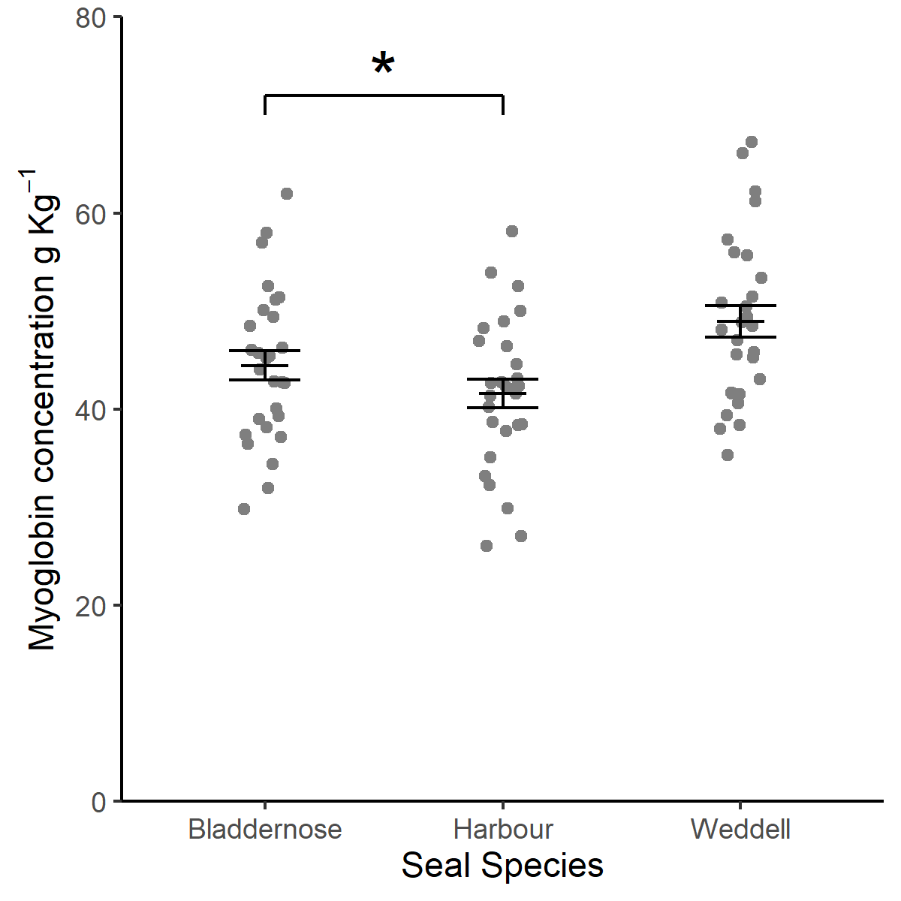

```{r setup, include=FALSE}
knitr::opts_chunk$set(echo = TRUE, 
                      message = FALSE,	
                      warning = FALSE,
                      fig.width=4, 
                      fig.height=4, 
                      fig.retina=3)
options(htmltools.dir.version = FALSE)
```


```{r packages, include=FALSE}
library(RefManageR)
library(kableExtra)
library(tidyverse)
library(viridisLite)
```


```{r, load-refs, include=FALSE, cache=FALSE}
BibOptions(check.entries = FALSE,
           bib.style = "authoryear",
           cite.style = "authoryear",
           style = "markdown",
           hyperlink = TRUE,
           dashed = FALSE,
           longnamesfirst = FALSE,
           max.names = 2)
myBib <- ReadBib("../refs.bib", check = FALSE)
```

class: inverse

# Aims and Learning Objectives 

---
# Aims and LO

To introduce you to R Markdown for creating reproducible reports in a variety of output formats. Give you more practice organising analyses and working with data.

The successful participant will be able to:
.font80[
* explain what R Markdown is  
* appreciate the role of the YAML header  
* set default code chunk behaviour and that for individual chunks  
* use headings, simple text formatting and special characters  
* add citations and references with a .bib file  
* use inline code to report results in text  
* create automatically numbered tables and cross reference them in the text  
* create automatically numbered figures and cross reference them in the text  
]
---
# Goal!

By the end of this session you'll be able to do something like this:
<!-- standard markdown report in pdf, word or html -->
<!-- include a table, inline code, a figure,  -->

## demo.....

---
# How do you work?

* What program do you analyse your data in?  
* What program do you plot your data in?  
--

* What program do you use to write up the results to submit to a journal (or similar)?
* What is your process for getting your results in to your report?  
--

* What do you do when you get additional data? 
* What do you do if you wrote in Word formatted for one journal and now have to submit in PDF formatted for another?
---
# How do you work?

Typically people analyse, plot and write up in different programs. 

Graphs are saved to files and copied and pasted into the final report. 

This process relies on manual labour. 

If the data changes, the author must repeat the entire process to update the report.

---
background-image: url(../pics/rmarkdown.png)
background-position: 98% 18%
background-size: 180px

# R Markdown for reports

The brilliance of R Markdown `r Cite(myBib, "markdown1")` is that you can use a **single R Markdown file** to:

* save and execute code  

--

* do all your data processing, analysis and plotting  

--

* generate high quality reports that can be shared with an audience  

--


This is a time-efficient and reproducible way to write!

## `r emo::ji("sunglasses")`


---
# R Markdown for reports

Many output formats are supported!

.pull-left[

]
.pull-right[
.font80[
* Word
* Webpages - many styles and themes
* PDF
* journal article formats for many journals
* webslides
* powerpoint
* books
* blogs
* posters
* web applications including interactive
]
]

---
# Organising your work

You are going to work with some made-up data on the myoglobin content in the skeletal muscle of three species of seal

--

`r emo::ji("clapper")` Create a new project called 'seals'

--

`r emo::ji("clapper")` Inside 'seals', make folders called 'raw_data' and
'processed_data'

--

I strongly recommend avoiding spaces in names of files, folders and variable names.
R can cope with them....  but they can often confuse humans!

--

`r emo::ji("clapper")` Save a copy of [seal.txt](../seals/raw_data/seal.txt) to the 'raw_data' folder

---
# R Markdown for reports

Live demo

`r emo::ji("clapper")` Just watch for a while....

---
# R Markdown for reports

Key points from the demo

* mixes text and code  
* human readable  
* YAML header between the  \-\-\-
* code chunk options control whether the code and its output end up in your 'knitted' document  
* comments   
  * in a code chunk the \# is still used for comments  
  * in the text a comment is written like this  <!\-\- a comment \-\->
  * but use Ctrl+Shift+C  
* \# in the text indicate headings  


---
# R Markdown for reports

Your own R markdown file

`r emo::ji("clapper")` File | New File | R Markdown

--

`r emo::ji("clapper")` Delete everything except the YAML header the first code chunk

--

`r emo::ji("clapper")` Add your name, and a title 

You could copy and paste a title from [paper.html](../seals/paper.html)

---
class: inverse

# References 
---

# YAML

`r emo::ji("clapper")` I also recommend using the `bookdown` package `r Cite(myBib, "bookdown")` output types which handle cross referencing well.

```
---
title: "Variation in myoglobin content of skeletal muscle of seal species."
author: "Emma Rand"
output:
  bookdown::pdf_document2: default
  bookdown::word_document2: default
  bookdown::html_document2: default
bibliography: reference.bib
---

```

---
# Default code behaviour

`r emo::ji("clapper")` Set some **default** code chunk options. I recommend these:


````
```{r setup, include=FALSE}`r ''`
knitr::opts_chunk$set(echo = FALSE, 
                      warning = FALSE,
                      message = FALSE,
                      fig.retina = 3)
```
````
--
.font90[
`echo = FALSE` code will not be included in the output  
`warning = FALSE` and `message = FALSE` R messages and warnings will not be included  
`fig.retina = 3` for improving the appearance of R figures in HTML documents  
]
---

# Add a code chunk

Packages

The first two code chunks are usually for the default code chunk options (which I tend to call `setup`) and for package loading. 

`r emo::ji("clapper")` Use Insert | R to add a code chunk:

.pull-left[
````
```{r packages}`r ''`
library(tidyverse)

```
````
]
.pull-right[
* `r`indicates it is an R code chunk
* `packages` is just a name for the chunk. Naming chunks makes debugging easier.

]
---
class: inverse

# References 

---
# References

References and citations can be added by creating a .bib file containing references in BibTeX format and another line to the YAML header.

--

`r emo::ji("clapper")` Add `bibliography: mybibfile.bib` to the YAML header.<sup>1</sup>
.footnote[
1. There are other ways of including references such as using `RefManageR` package which is what I am using in these slides.

]

---
# References

Make a .bib file

`r emo::ji("clapper")` Do File | New file | Text file

`r emo::ji("clapper")` Save as `mybibfile.bib`

`r emo::ji("clapper")` Add BibTeX entries

`citation("package")` in the console will give packages references in BibTeX format.  

--

BibTeX format is also available through most referencing software (e.g., PaperPile).


---
# References

Citations are added using:
  *  blah blah blah `[@xaringan]` for blah blah blah `r Cite(myBib, "xaringan")`.    
  *  Xie `[-@xaringan]` said blah blah blah for `r Cite(myBib, "xaringan",textual = TRUE)` said blah blah blah.  

--

If you have installed the `citr` package there is an Addin to help with this.

--

Every citation used results in the reference being added to a list at the bottom of the output.

---

# Add text

Introduction

`r emo::ji("clapper")` Add a header for the Introduction and text - again you could copy and paste. 

```
# Introduction
Aquatic and marine mammals are able to dive
underwater.................................
...investigated whether the concentration of
myoglobin differed between  species.

```
---
# Your turn

`r emo::ji("clapper")` Include at least one reference in your introduction, such as this one: https://doi.org/https://doi.org/10.1016/S1095-6433(00)00182-3.

--

`r emo::ji("clapper")` Save your file.


---
# Your turn

`r emo::ji("clapper")` Add a heading for the Methods section including at least one reference to R or packages.


--

`r emo::ji("clapper")` Hit Knit! `r emo::ji("knit")`

This should render as something like:

We used R (R Core Team 2019) with tidyverse packages (Wickham 2017) for all analyses.

---
class: inverse

# Code chunks 
---
# Add a code chunk

`r emo::ji("clapper")` Insert a code chunk for importing the data


````
```{r import}`r ''`
# the data are organised in to three 
# columns, one for each species. 
seal <- read.table("raw_data/seal.txt", header = TRUE)
```
````
--
Notice than you can, and should, comment your code.

---
# Run a code chunk

You can run the code interactively to check your progress.

`r emo::ji("clapper")` Run the whole code chunk using the green arrow button on the right of the code chunk:
````
```{r import}`r ''`
# Data import
# the data are organised in to three
# columns, one for each species. 
seal <- read.table("raw_data/seal.txt", header = TRUE)
str(seal)
```
````
---
# Run a code chunk

Output is shown in the Rmd document.

````
'data.frame':	30 obs. of  3 variables:
 $ Harbour    : num  49.7 51 41.6 45.6 39.4 ...
 $ Weddell    : num  55.4 40.1 46.3 29.8 52.5 ...
 $ Bladdernose: num  56.2 48.4 37.8 42.8 27 ...
```` 

--
Individual lines of code can be run by placing your cursor on the line and doing ctl-enter.

---
# Add a code chunk

We have a group in each column and need to reformat it as we did with the two populations of pigeons.

`r emo::ji("clapper")` Insert a code chunk for tidying the data:

````
```{r tidy}`r ''`
seal2 <- seal %>% 
  pivot_longer(names_to = "species",
               values_to = "myoglobin",
               cols = everything())  

```
````

---
# Add a code chunk

`r emo::ji("clapper")` Insert a code chunk for summarising the data:

````
```{r summarise}`r ''`
sealsummary <- seal2 %>% 
  group_by(species) %>% 
  summarise(mean = mean(myoglobin),
            std = sd(myoglobin),
            n = length(myoglobin),
            se = std/sqrt(n))
```
````

This time we save to output to `sealsumary`. We will use it in plotting

---
# What is in sealsummary?

To see what it is in an object you execute its name.

`r emo::ji("clapper")` Select the word `sealsummary` and and run with Ctrl-enter


--

Knit your file

---
class: inverse

# Inline code 
---
# Inline code

Inline code is how you include a variable value, like a mean, in a section of text.

--

In fact, any code output can be inserted directly into the text of a .Rmd file using inline code.

--

Inline code goes between ` `r` and ` ` ` . 

For example by writing: 

> The squareroot of 2 is ` `r`  `sqrt(2)` ` ` ` 

you will get 

> The squareroot of 2 is  `r sqrt(2)`

---
# Your turn

`r emo::ji("clapper")` Add a sentence to your Methods section which uses inline code to report how many individuals were examined.

--

We measured the myoglobin content of the skeletal muscle of ` `r`  `sealsummary$n[1]` ` ` ` individuals in each of three species.

---
# Inline code

Suppose you want to report the highest mean in the text.

We could add

> The highest mean is ` `r`  `max(sealsummary$mean)` ` ` `

to our text. 

When we knit the document we would get

> The highest mean is 48.91429

--

This needs rounding.
---
# Inline code


> The highest mean is ` `r`  `round(max(sealsummary$mean), 2)` ` ` `


The inline code is getting long. It is worse if you want to include 

"The highest mean is 48.91 $\pm$ 1.61"

--

.font70[

> The highest mean is ` `r`  `round(max(sealsummary$mean), 2)` ` ` ` $\pm$ ` `r`  `round(sealsummary$se[sealsummary$mean == max(sealsummary$mean)], 2)` ` ` `
]

--

Rmd is supposed to be readable!

---
# Inline code - keep short

To avoid long pieces of inline code, we instead extract the values we want within a code chunk.

`r emo::ji("clapper")` Insert a code chunk to extract values from the summary:

Don't worry too much about completely understanding the code
.font80[

````
```{r extract}`r ''`
\# extract values for inline reporting

highestmean <- max(sealsummary$mean)
highestse <- sealsummary$se[sealsummary$mean == highestmean]
highestspp <- sealsummary$species[sealsummary$mean == highestmean]
```
````


]
`r kableExtra::text_spec("Extra exercise:", background = "#25496b", color = "#fdf9f6", bold = TRUE)` Repeat for the lowest mean.
<!-- lowestmean <- min(sealsummary$mean) -->
<!-- lowestse <- sealsummary$se[sealsummary$mean == lowestmean] -->
<!-- lowestspp <- sealsummary$species[sealsummary$mean == lowestmean] -->


---
# Your turn.

`r emo::ji("clapper")` Make a start on a results section by mixing text and inline coding. 

`r emo::ji("clapper")` Knit your document. `r emo::ji("knit")`

---
class: inverse

# Special characters 

---
# Special characters

You can include special characters in an R markdown document using LaTeX. 

This has `$` signs around codes that use backslashes and curly braces to indicate a special character or special formatting.

--

For example, to get $\bar{x} \pm s.e.$ you write `$\bar{x} \pm s.e.$`

`r emo::ji("clapper")` Improve your results section by using special characters.

---
class: inverse

# Numbered tables 

---
# Adding a table

the `knitr` package's `kable()` function is a useful way to include tables. `kable()` takes a dataframe as an argument and has options to format the contents as a table. 

--

For example, `digits` will round the number of decimal places used.

--

`r emo::ji("clapper")` Add a code chunk for a table of the summarised data:

````
```{r summary-table}`r ''`
knitr::kable(sealsummary,
             digits = 2,
             caption = 'A summary of the data.',
             row.names = FALSE)
```
````
---
# Cross-reference the table.

````
```{r summary-table}`r ''`
knitr::kable(sealsummary,
             digits = 2,
             caption = 'A summary of the data.',
             row.names = FALSE)
```
````
For automatic numbering and cross-references in text, you need to ensure two things in the chunk:

1. the chunk must be labelled. I've used `summary-table`  
2. the table must have a caption as set by the `caption` argument

--

`r emo::ji("exclamation_mark")` The caption does include "Table 1." 

---
# Cross-reference in text

To refer to this table in the text, we use `\@ref(tab:summary-table)`

`r emo::ji("clapper")` Add a sentence to your results referring to the reader to the summary table such as: See table \\@ref(tab:summary-table)

--

`r emo::ji("clapper")` Hit knit! `r emo::ji("knit")`

---
# Cross-reference in text

The general syntax for cross-references is `\@ref(label)` where label can be:  
`tab:name-of-chunk-that-makes-a-table` or  
`fig:name-of-chunk-that-makes-a-figure`

---
class: inverse

# Statistical testing with ANOVA and Tukey 

---
# Statstical testing

An appropriate analysis for this scenario is a one-way ANOVA followed by a Tukey Honest Significant Difference post-hoc test. 

--

We will first build the ANOVA model and extract the results.

--

`r emo::ji("clapper")` Insert a code chunk and build the model:

````
```{r testing}`r ''`
mod <- aov(data = seal2, myoglobin ~ species)
```
````

---
# Statstical testing: ANOVA

`r emo::ji("clapper")` A dataframe containing the ANOVA table can be obtained with:

````
res <- summary(mod)[[1]]
````

---
# Your turn

`r emo::ji("clapper")` Extract the *F*, *d.f.* and *p* values from the dataframe and report them in the results section by mixing text and inline coding.


---
# Statstical testing: Tukey

`r emo::ji("clapper")` Insert a code chunk and run a Tukey HSD on the model:

````
```{r posthoc, include=FALSE}`r ''`
TukeyHSD(mod)
```
````

Note: I have added the `include=FALSE` argument to the chunk. This suppresses the output in the knitted document.

---
# Statstical testing: Tukey

`r emo::ji("clapper")` Run the Tukey code:

.font80[

````
  Tukey multiple comparisons of means
    95% family-wise confidence level

Fit: aov(formula = myoglobin ~ species, data = seal2)

$species
                         diff       lwr       upr     p adj
Harbour-Bladdernose -2.835357 -7.968374  2.297660 0.3889209
Weddell-Bladdernose  4.474286 -0.658731  9.607302 0.1001324
Weddell-Harbour      7.309643  2.176626 12.442660 0.0029812
````
]
--
It's the highest (Weddell) and lowest (Harbour) means that differ.

---
class: inverse

# Numbered figures 

---
# Adding a figure
.pull-left[
This is what we are aiming for:

```{r myo-fig, echo = FALSE, out.height="350px"}



```
]

.pull-right[

For automatic numbering and cross-referencing:

1. the chunk must be labelled. I'll used `myo-fig`  
2. the figure must have a caption *but* this time it is set in the code chunk options using `fig.cap` 

To refer to this figure in the text, we use `\@ref(fig:myo-fig)`
]
---
# Adding a figure

We will go through the items that need to be in the markdown with a basic plot.

`r emo::ji("clapper")` Add a code chunk for the figure:
.font80[

````
```{r myo-fig, fig.cap="Mean Myoglobin content of skeletal muscle"}`r ''`
ggplot() +
  geom_point(data = seal2, aes(x = species, y = myoglobin),
             position = position_jitter(width = 0.1, height = 0))
```
````
]

--

I have labelled the chunk `myo-fig` and set the caption with `fig.cap`.


---
# Cross reference a figure

`r emo::ji("clapper")` Now add a sentence to your results such as: See Figure \\@ref(fig:myo-fig)


--

`r emo::ji("clapper")` Hit knit! `r emo::ji("knit")`

You should find the figure and the cross reference to it are automatically numbered.


---
# Long figure legends

Figure legends are often long and contain special characters

--

Including long text in the code chunk option makes the code a bit hard to read and special characters are difficult.

--

We can instead create a 'reference' for the legend.


`r emo::ji("clapper")`Add this text to your document:  

  (ref:myo-fig) Mean Myoglobin content of skeletal muscle. Error bars are $\pm 1 s.e.$


---
# Adding a figure

`r emo::ji("clapper")`And edit your chunk options like this: 

.font80[

````
```{r myo-fig, fig.cap="(ref:myo-fig)"}`r ''`
ggplot() +
  geom_point(data = seal2, aes(x = species, y = myoglobin),
             position = position_jitter(width = 0.1, height = 0))
```
````

]

--

`r emo::ji("clapper")` Hit knit! `r emo::ji("knit")`

---
# Your turn

Suggestions:

* customise this figure (see the Seal example)  
* add an additional figure  
* add an image as a figure  
* Try out a template from `rticles`: File | New File | R Markdown and choose From Template


---
# R Markdown Resources

* R Markdown cheatsheet: https://www.rstudio.com/wp-content/uploads/2015/02/rmarkdown-cheatsheet.pdf  

* RStudio’s guide http://rmarkdown.rstudio.com/index.html  

* R Markdown: The Definitive Guide `r Cite(myBib, "markdown2")` https://bookdown.org/yihui/rmarkdown/   
 
* bookdown: Authoring Books and Technical Documents with R Markdown `r Cite(myBib, "bookdown")` https://bookdown.org/yihui/bookdown/  


---
# Summary

.font90[

* R Markdown interweaves analysis code and reporting and is human readable  
* metadata about the document is given YAML header  
* there are many formats for outputs and several packages available  
* code chunk behaviour such as visibility and output size is set with options 
* `#` is a heading in the text and a comment (as normal), in a code chunk
* LateX can be included  
* citations and references are added with a .bib file  
* use inline code to report results in text  
* automatically numbered tables and figures and cross references to them can be included  
] 

---

class: inverse

# `r emo::ji("party")` Congratulations! Keep practising! `r emo::ji("party")` 

.footnote[
Slides made with with xaringan `r Cite(myBib, "xaringan")`

]
---
# References
.font60[
```{r refs, echo=FALSE, results="asis"}
PrintBibliography(myBib)  
```
]
---
# Reproducibility in R

Emma Rand [emma.rand@york.ac.uk](mailto:emma.rand@york.ac.uk)  
Twitter: [@er13_r](https://twitter.com/er13_r)  
GitHub: [3mmaRand](https://github.com/3mmaRand)  
blog: https://buzzrbeeline.blog/  
<br>
<a rel="license" href="http://creativecommons.org/licenses/by-nc-sa/4.0/"></a><br /><span xmlns:dct="http://purl.org/dc/terms/" property="dct:title">Royal Society of Biology Online: An Introduction to Reproducible Analyses in R</span> by <span xmlns:cc="http://creativecommons.org/ns#" property="cc:attributionName">Emma Rand</span> is licensed under a <a rel="license" href="http://creativecommons.org/licenses/by-nc-sa/4.0/">Creative Commons Attribution-NonCommercial-ShareAlike 4.0 International License</a>.


